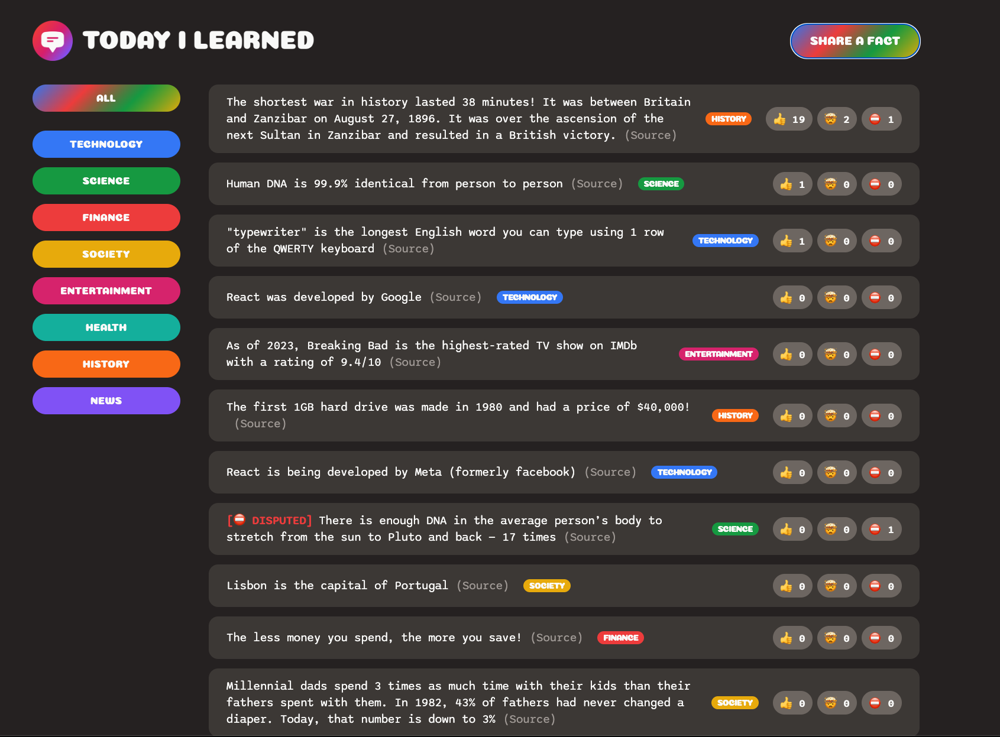

# Share Fact Platform

**Live Demo:** [Click Here](https://share-fact-v1.netlify.app/)

**Author:** Jason Guan

---

## Overview

Share Fact is an interactive platform where users can **share interesting facts**, express their opinions.

Users can engage with each fact through fun and expressive voting options — 👍 Interesting, 🤯 Mind-blowing, and ⛔ False.
This intuitive voting system allows everyone to instantly see the community’s overall sentiment toward each fact.
If a fact receives significantly more “False” votes than positive ones, the app automatically flags it as Disputed, visually highlighting that the community questions its credibility.

Built with the **React** frontend framework and powered by **Supabase** as the backend database API, this app ensures real-time data updates and seamless communication between the client and the server.

All the **HTML** and **CSS UI** designs were implemented manually by me, featuring **mobile-friendly adaptability** to provide a consistent and elegant experience across all devices.

---

## Key Features

- Share your facts and opinions with the world
- Interactive voting system for interesting, mind-blowing, or false facts
- Supabase backend with real-time updates
- Responsive and elegant UI design implemented with pure HTML & CSS
- Fully optimized for mobile users
- Simple setup to run locally or deploy to the web

---

## Tech Stack

| Layer      | Technology                         |
| ---------- | ---------------------------------- |
| Frontend   | React.js, HTML, CSS                |
| Backend    | Supabase API (PostgreSQL Database) |
| Deployment | Netlify (Frontend Hosting)         |

---

## Examples

- **Platform Demo Page:**
  
- **Interactive Functions:**
  

---

## Frontend & Backend Architecture

```
┌──────────────────────────────┐
│          Frontend            │
│  React Application (UI)      │
│  ├─ Components (Facts, Form) │
│  ├─ Hooks (useState, useEffect)
│  ├─ REST Calls to Supabase   │
└──────────────┬───────────────┘
               │ HTTPS (API)
               ▼
┌──────────────────────────────┐
│          Backend             │
│   Supabase (PostgreSQL DB)   │
│   ├─ Facts Table             │
│   ├─ Auth & Storage          │
│   └─ Row-Level Security (RLS)│
└──────────────┬───────────────┘
               │
               ▼
        Persistent Cloud Storage
```

---

## Local Setup

In the project directory, you can run:

### `npm start`

Runs the app in development mode.
Open [http://localhost:3000](http://localhost:3000) to view it in your browser.

The page will reload when you make changes.
You may also see lint errors in the console.

### `npm test`

Launches the test runner in the interactive watch mode.
See the section about [running tests](https://facebook.github.io/create-react-app/docs/running-tests) for more information.

### `npm run build`

Builds the app for production to the `build` folder.
It correctly bundles React in production mode and optimizes the build for the best performance.

The build is minified and the filenames include the hashes.
Your app is ready to be deployed!

### `npm run eject`

**Note:** This is a one-way operation. Once you eject, you can’t go back!

If you aren’t satisfied with the build tool and configuration choices, you can eject at any time. This command will remove the single build dependency from your project.

At this point you have full control over configuration files like webpack, Babel, and ESLint.

You don’t have to use eject—the curated setup works great for most small and medium projects.

---

## 🎉 Have Fun

Enjoy sharing and discovering new facts!
Contributions, suggestions, and feedback are always welcome.
